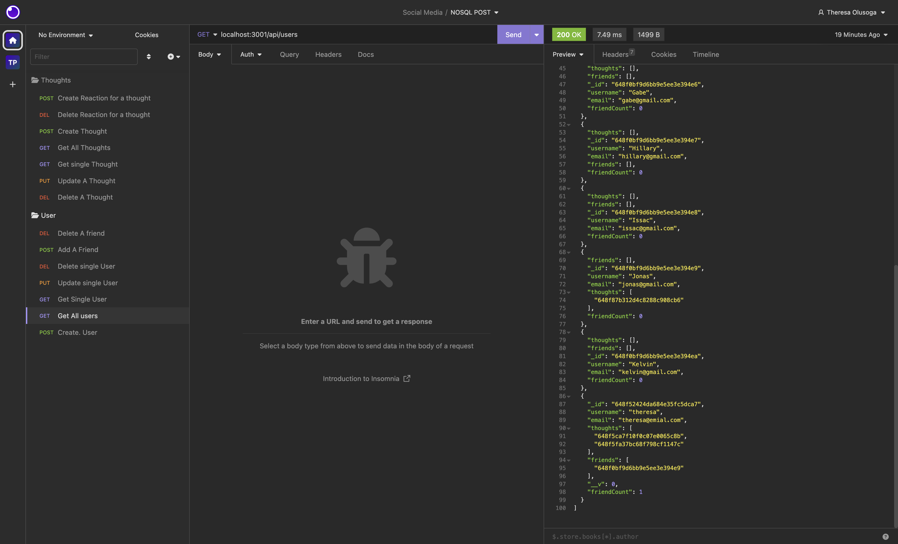
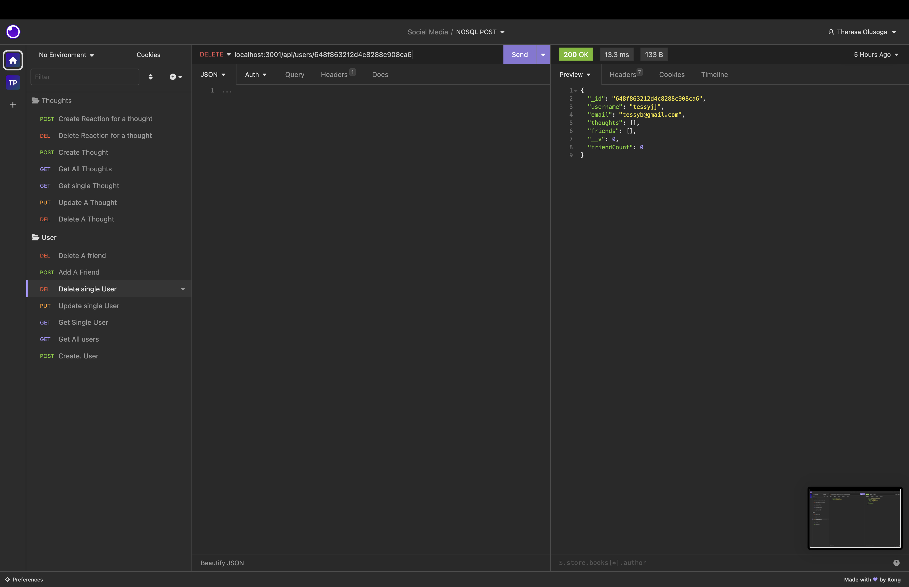
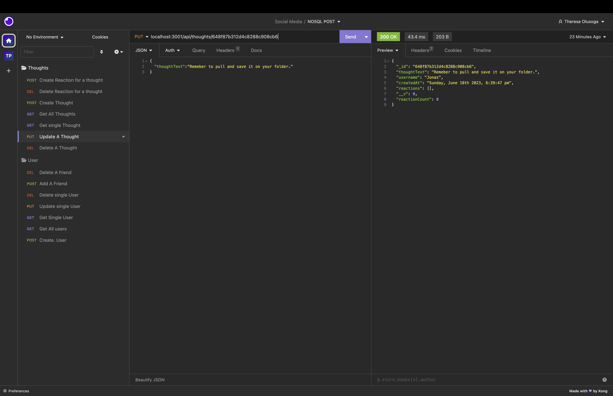
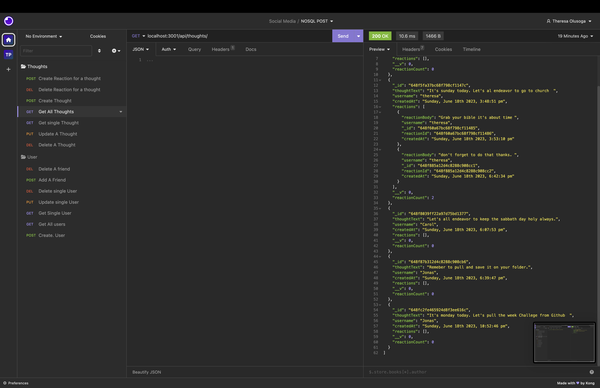

# # Project Name social-media

# Project URL

https://github.com/TessyJ/social-media

# Project Repository

https://tessyj.github.io/social-media/

# Walkthrough Video

https://drive.google.com/file/d/138PLiDo3AV-QARHHpouSM-yNjAJ8sUls/view

# Project Description

A startup social network web application created where users can share their thoughts, react to friends' thoughts, and create a friend list.
These dependencies": {
"Express": "^4.18.2",
"moment": "^2.29.4",
"mongoose": "^7.2.4",
"nodemon": "^2.0.22"
} where used in their respective `package.json.
The data for each of these routes were displayed in a formatted JSON in Insomnia

# Screen Shot

[screenshot1](images/shot1.png)

